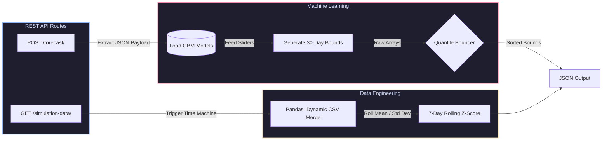
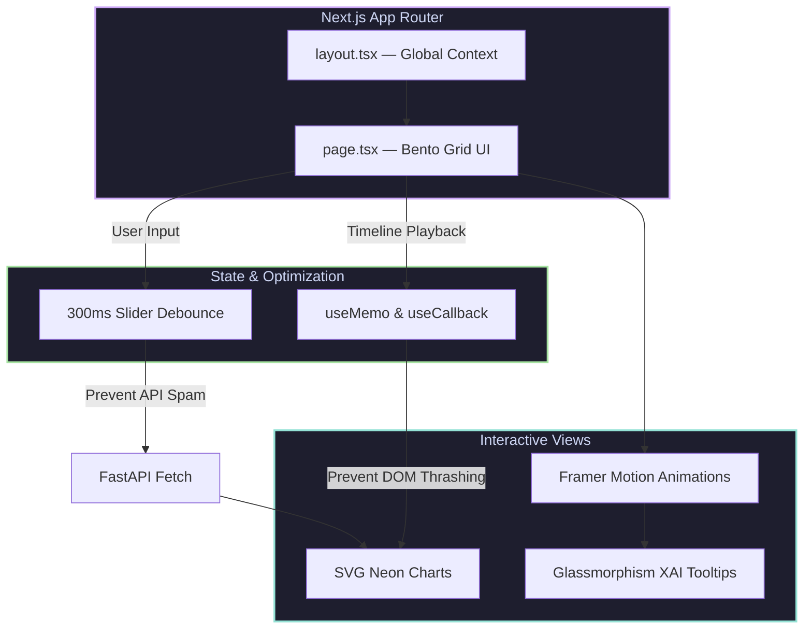

<div align="center">
  <br/>
  
  <br/><br/>

  # H · I · V · E

  ### **Hype-Intelligence Volatility Engine**
  *Institutional-grade market forecasting, powered by the speed of internet sentiment.*

  <br/>

  
  
  
  
  

  <br/>

  > **When GameStop went parabolic in 2021, every quant model on Wall Street failed.**
  > H.I.V.E. was built to make sure it never catches you off-guard again.

  <br/>

[**→ View Demo**](https://emotion-forecaster.vercel.app/) &nbsp;·&nbsp; [**→ Quick Start**](#installation) &nbsp;·&nbsp; [**→ Architecture**](#architecture)

  <br/>

  

  <br/><br/>

</div>

---

## What is H.I.V.E.?

H.I.V.E. is an **Explainable AI (XAI)** web application that transforms 53,000 raw social media posts into actionable, statistically-bounded market forecasts. It bridges the gap that traditional quant models can't cross — the irrational, narrative-driven volatility of retail-dominated markets.

Traditional models price *fundamentals.* H.I.V.E. prices **hype.**


** Time Machine** — Replay historical market crashes at 60fps, watching AI predictions unfold against real price action in real time.

** Root Cause XAI** — Click any data point to reveal the exact Reddit post — and its upvote count — that drove the model's prediction.

** What-If Sandbox** — Adjust sentiment and hype sliders to instantly project a 30-day "Cone of Uncertainty" for any scenario.

---

## Features

<details>
<summary><b> Early Warning Radar</b></summary>
<br/>
A live feed that continuously monitors statistical anomalies. When daily sentiment breaches a Z-Score of ≥ 2.0 or ≤ −2.0, H.I.V.E. triggers a real-time <code>MARKET PANIC</code> or <code>EXTREME EUPHORIA</code> alert — before price action confirms it.
<br/><br/>
</details>

<details>
<summary><b> Dynamic Sector Heatmaps</b></summary>
<br/>
Animated radar charts that visualize live capital flow battles across <strong>Tech</strong>, <strong>EV</strong>, <strong>Finance</strong>, and <strong>Meme</strong> sectors. Watch sentiment shift in real-time as narratives dominate the feed.
<br/><br/>
</details>

<details>
<summary><b> Cross-Tab Branching</b></summary>
<br/>
Pause the historical timeline on any volatile day, click <strong>"Branch to Sandbox,"</strong> and the exact market conditions — price, sentiment score, hype volume — are instantly cloned into the forecasting engine. No manual re-entry.
<br/><br/>
</details>

<details>
<summary><b> Quantile Regression AI</b></summary>
<br/>
Three concurrent GBM models generate a mathematically-bounded 30-day forecast. A custom <strong>"Quantile Bouncer"</strong> algorithm in FastAPI guarantees confidence intervals never cross — lower &lt; median &lt; upper, always.
<br/><br/>
</details>

---

## Architecture

H.I.V.E. is a three-stage pipeline: raw text → NLP enrichment → ML inference → live dashboard.


<details>
<summary><b>Backend Data Flow (FastAPI & ML Inference)</b></summary>
<br/>



</details>

<details>
<summary><b>Frontend Render Pipeline (Next.js)</b></summary>
<br/>



</details>

---

## Tech Stack

<table>
  <thead>
    <tr>
      <th>Layer</th>
      <th>Technology</th>
      <th>Role</th>
    </tr>
  </thead>
  <tbody>
    <tr>
      <td><b>Frontend</b></td>
      <td>React / Next.js 13+</td>
      <td>App Router, server/client boundary architecture</td>
    </tr>
    <tr>
      <td></td>
      <td>Tailwind CSS + Framer Motion</td>
      <td>Dark-mode Bento Grid, glassmorphism, spring animations</td>
    </tr>
    <tr>
      <td></td>
      <td>Recharts</td>
      <td>Cone of Uncertainty area graphs, neon SVG line charts</td>
    </tr>
    <tr>
      <td><b>Backend</b></td>
      <td>FastAPI (Python)</td>
      <td>High-perf REST API, automatic JSON serialization</td>
    </tr>
    <tr>
      <td></td>
      <td>Scikit-Learn + Joblib</td>
      <td>Serving three pre-trained GBM models for Quantile Regression</td>
    </tr>
    <tr>
      <td></td>
      <td>NLTK VADER</td>
      <td>Distills raw social posts into quantitative sentiment scores</td>
    </tr>
    <tr>
      <td></td>
      <td>Pandas + NumPy</td>
      <td>On-the-fly merging, rolling stats, Z-Score anomaly detection</td>
    </tr>
  </tbody>
</table>

---

## Installation

> **Prerequisites:** Python 3.9+ · Node.js 18+

### 1 — Clone

```bash
git clone https://github.com/mushir2004/Emotion-Forecaster.git
cd Emotion-Forecaster
```

### 2 — Start the Backend

```bash
# Create and activate a virtual environment
python3 -m venv .venv
source .venv/bin/activate        # Windows: .venv\Scripts\activate

# Install Python dependencies
pip install -r requirements.txt

# Launch the FastAPI server
uvicorn src.main:app --reload --port 8000
```

> Backend live at `http://localhost:8000`

### 3 — Start the Frontend

```bash
# Open a new terminal
cd frontend
npm install
npm run dev
```

> Dashboard live at `http://localhost:3000`

---

## Usage Guide

| Step | Where | What to do |
|------|-------|------------|
| **1** | Home | Read the mission — understand the data flow from raw Reddit to risk forecast |
| **2** | Time Machine | Hit **Play** and watch the 2021 crash unfold. Click any spike to open the Reddit post that drove it |
| **3** | Sandbox | Drag **Retail Sentiment** to 90% and watch the 30-day Cone of Uncertainty shift — no dropped frames |
| **4** | Branch | Pause the timeline on any volatile day → **Branch to Sandbox** to clone conditions into the forecaster |

---

## Limitations & Roadmap

**Current limitations**

-  **Static dataset** — models trained exclusively on the 2021 meme-stock era (53k posts). No live scraping yet.
-  **Linear sentiment decay** — the Sandbox uses a hardcoded 10% daily decay rate. Real hype dynamics are non-linear.


---

## Project Structure

```
Emotion-Forecaster/
├── assets/
│   ├── models/                  # Pre-trained GBM models (.pkl)
│   └── *.csv                    # Cleaned datasets (mega_cap, reddit_wsb, …)
├── backend/
│   ├── process_megacaps.py      # Mega-cap sentiment isolation
│   ├── process_root_cause.py    # Narrative driver extraction
│   └── process_sectors.py       # Sector sentiment mapping
├── frontend/
│   ├── app/                     # Next.js App Router (page.tsx, layout.tsx)
│   ├── public/                  # Static assets
│   ├── globals.css              # Tailwind base styles
│   └── package.json
├── src/                         # FastAPI server (main.py + routers)
├── .env.example
└── README.md
```

---

<div align="center">
  <br/>
  <sub>Built for the <b>NatWest Group "Code for Purpose"</b> India Hackathon</sub>
  <br/>
  <sub>Traditional math failed in 2021. H.I.V.E. didn't have to.</sub>
  <br/><br/>
</div>
