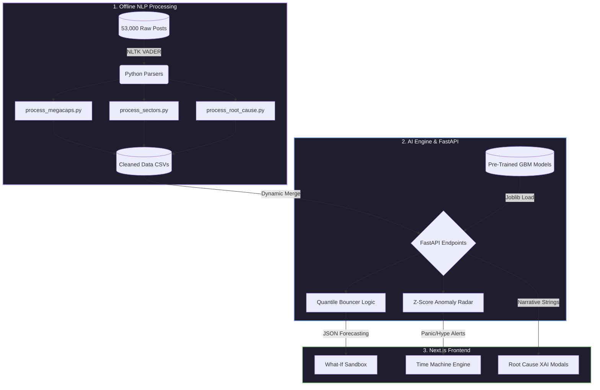
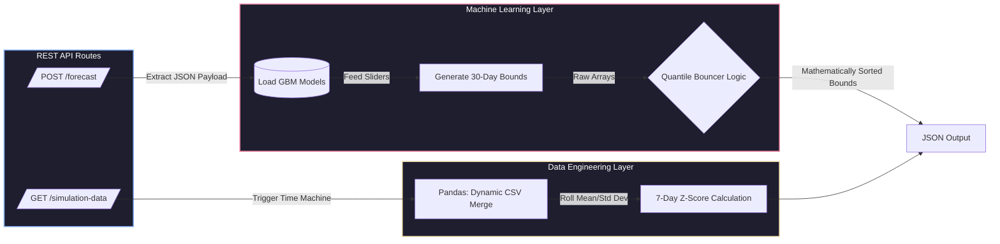
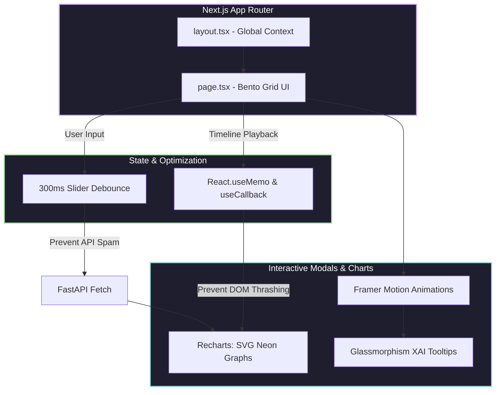

<div align="center">

  # 🐝 H.I.V.E. (Emotion-Forecaster)
  **Institutional Market Forecasting Driven by the Speed of Internet Sentiment.**

  [](https://reactjs.org/)
  [](https://fastapi.tiangolo.com/)
  [](https://scikit-learn.org/)
  [](#)

  <p>
    Traditional math failed during the 2021 meme-stock crisis. H.I.V.E. bridges the gap between chaotic internet culture and actionable financial data, transforming 53,000 raw social media posts into highly accurate, explainable market forecasts.
  </p>

</div>

---

## 1. Overview

**What it does:** H.I.V.E. is an Explainable AI (XAI) web application that quantifies raw internet sentiment and uses machine learning to predict market volatility. It features a historical "Time Machine" to replay past market crashes and a "What-If Sandbox" for predictive scenario testing. 
**What problem it solves:** Traditional quantitative models cannot account for sudden, sentiment-driven market anomalies (like retail hype or panic). H.I.V.E. solves this by tracking narrative drivers and providing mathematically sound confidence intervals for volatile assets.
**Intended users:** Financial analysts, institutional risk managers, and advanced retail traders looking to stress-test portfolios against social sentiment shocks.

---

## 2. Implemented Features

*   **Historical Proof "Time Machine":** A live timeline engine that plays back the 2021 market anomaly at 60fps, plotting the AI's predictions versus actual historical prices.
*   **Root Cause Explainable AI (XAI):** Click any data point on the chart to instantly open a glassmorphism modal revealing the exact social media post (and upvote count) that drove the model's prediction.
*   **Early Warning Radar:** A live feed that automatically flags statistical anomalies. When daily sentiment breaches a Z-Score of $\ge 2.0$ or $\le -2.0$, the UI triggers a "Market Panic" or "Extreme Euphoria" alert.
*   **Dynamic Sector Heatmaps:** Animated radar charts that visually track the tug-of-war of capital flow across Tech, EV, Finance, and Meme sectors.
*   **Predictive "What-If Sandbox":** A 30-day forecasting engine where users can adjust current price, retail sentiment, and hype volume via sliders to instantly generate a projected "Cone of Uncertainty" without layout thrashing.
*   **Cross-Tab Branching:** Users can pause the historical timeline on a volatile day, click "Branch to Sandbox," and instantly copy those exact market conditions into the forecasting engine.

---

## 3. Tech Stack

**Frontend (Client)**
*   **React / Next.js (App Router):** Core UI framework utilizing modern server/client boundary architecture.
*   **Tailwind CSS & Framer Motion:** Used for the dark-mode Bento Grid design, glassmorphism, and buttery-smooth spring animations.
*   **Recharts:** For rendering the complex "Cone of Uncertainty" area graphs and custom SVG-filtered neon line charts.

**Backend (Server & AI)**
*   **FastAPI & Python:** High-performance backend for automatic JSON serialization and low-latency endpoints.
*   **Scikit-Learn (Joblib):** Serving three pre-trained Gradient Boosting Machine (GBM) models for Quantile Regression.
*   **NLTK (VADER):** Natural Language Processing used to distill raw posts into quantitative sentiment scores.
*   **Pandas & NumPy:** For on-the-fly mathematical processing, merging, and standard deviation calculations.

---

## 4. Highlighting Technical Depth (Architecture)

We built H.I.V.E. to be institutional-grade. Below is the system architecture diagram illustrating how raw unstructured data flows through our NLP pipelines, into our machine learning models, and finally to the Next.js frontend.



### The AI Engine & Quantile Regression
We utilize three concurrent **Gradient Boosting Machine (GBM)** models (`lower_model.pkl`, `median_model.pkl`, `upper_model.pkl`). Instead of predicting a single price, the AI generates a 30-day forward-looking boundary. 
*   **The Quantile Bouncer:** Machine learning models can occasionally hallucinate, causing confidence intervals to cross. We hardcoded a sorting algorithm inside FastAPI that intercepts raw predictions and mathematically guarantees bounds stay logical (lower < median < upper) before hitting the React frontend.

### Data Engineering & NLP Pipelines
To prevent API lag from parsing 53,000 text posts live, we built offline Python pipelines under the `backend/` directory using NLTK's VADER. 
*   **Root Cause Extraction:** Groups posts by date, identifies the absolute highest-upvoted post, and logs its text/URL to serve as the daily "Narrative Driver" for the XAI modal.
*   **Anomaly Detection (Z-Score):** The API calculates a 7-day rolling mean and standard deviation for the daily emotion score. It runs a live Z-Score calculation to detect statistical anomalies dynamically.

## 4.1 Backend Data Flow (FastAPI & AI Inference)
This diagram details the internal routing of our FastAPI server, showing how historical datasets and live ML inferences are mathematically processed before hitting the client.



## 4.2 Frontend Render Pipeline (Next.js)
To achieve a buttery-smooth 60fps historical playback and instant slider updates without crashing the browser, the frontend relies heavily on React performance hooks and optimized rendering libraries.



## 5. Folder Structure

```text
Emotion-Forecaster/
├── assets/                     # Core data dependencies
│   ├── models/                 # Pre-trained GBM AI models (.pkl)
│   └── *.csv                   # Cleaned datasets (mega_cap, reddit_wsb, etc.)
├── backend/                    # Python NLP & Data Engineering Scripts
│   ├── process_megacaps.py     # Mega-cap sentiment isolation
│   ├── process_root_cause.py   # Narrative driver extraction
│   └── process_sectors.py      # Sector sentiment mapping
├── frontend/                   # Next.js Dashboard
│   ├── app/                    # Next.js 13+ App Router (page.tsx, layout.tsx)
│   ├── public/                 # Static frontend assets
│   ├── globals.css             # Tailwind & Base styling
│   └── package.json            # Node dependencies
├── src/                        # FastAPI Server logic (main.py, routers)
├── .env.example                # Example environment variables
├── .gitignore                  # Git ignore rules
└── README.md                   # You are here
```

---

## 6. Install and Run Instructions

This project requires **Python 3.9+** and **Node.js 18+**. 

### Step 1: Clone the Repository
```bash
git clone https://github.com/mushir2004/Emotion-Forecaster.git
cd Emotion-Forecaster
```

### Step 2: Start the FastAPI Backend
```bash
# Create and activate a virtual environment (Recommended)
python3 -m venv .venv
source .venv/bin/activate  # On Windows: .venv\Scripts\activate

# Install dependencies (assuming you have a requirements.txt at root or src)
pip install -r requirements.txt

# Start the FastAPI server
uvicorn src.main:app --reload --port 8000
```
*The backend is now running at `http://localhost:8000`.*

### Step 3: Start the React/Next.js Frontend
Open a **new terminal window**:
```bash
cd frontend

# Install dependencies
npm install

# Start the development server
npm run dev
```
*The frontend is now running at `http://localhost:3000`. Open this link in your browser to view H.I.V.E.*

---

## 7. Usage Examples

### Using the Web Application
1. **The Pitch (Home):** Read the mission statement and understand the data flow.
2. **The Time Machine:** Navigate to the "Historical Proof" tab. Click the **Play** button on the timeline to watch the 2021 market crash unfold. Watch the live ticker update and click any spike on the graph to view the Reddit post that caused it.
3. **The Sandbox:** Navigate to the "Predictive Engine". Drag the "Retail Sentiment" slider up to 90% and watch the 30-day forecast dynamically shift to a bullish trajectory without dropping frames.


---

## 8. Limitations and Future Improvements

**Current Limitations:**
*   **Static Historical Data:** The current NLP models were trained strictly on the 53,000-post dataset from the 2021 meme-stock era. It does not currently scrape Reddit or X (Twitter) in live real-time.
*   **Sentiment Decay:** In the Sandbox, we currently use a hardcoded 10% daily decay rate for sentiment to simulate "cooling hype." In reality, hype decay is non-linear and much more unpredictable.

**Future Improvements:**
*   **Live Webhooks:** Integrate the official Reddit API to process live VADER sentiment scores instead of historical CSVs.
*   **Expanded Asset Classes:** Train the sector tug-of-war algorithm to include Crypto and Forex markets, where retail sentiment plays an even larger role.

---
*Developed for the NatWest Group "Code for Purpose" India Hackathon.*
